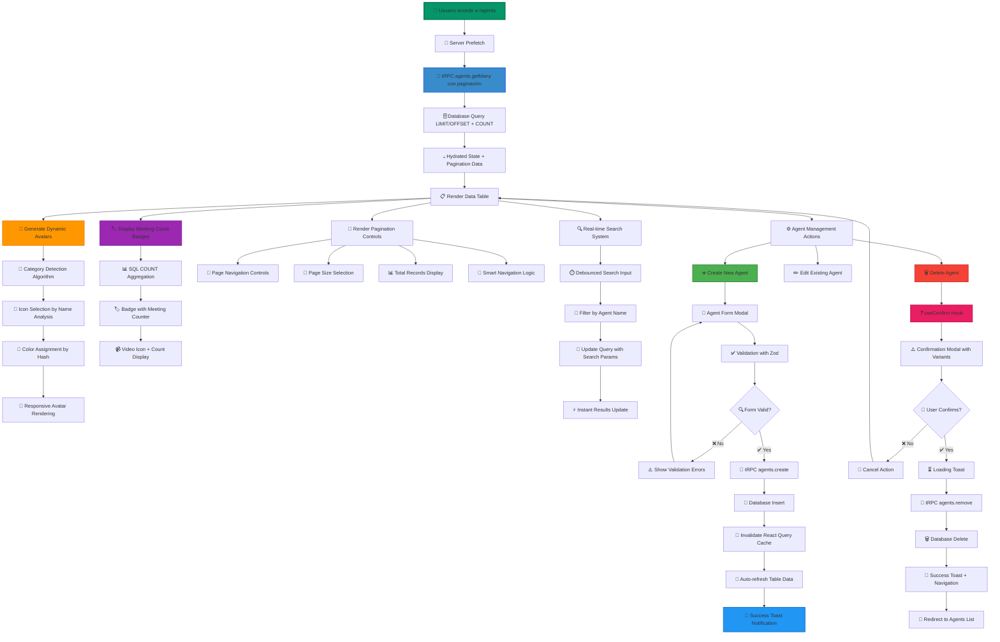
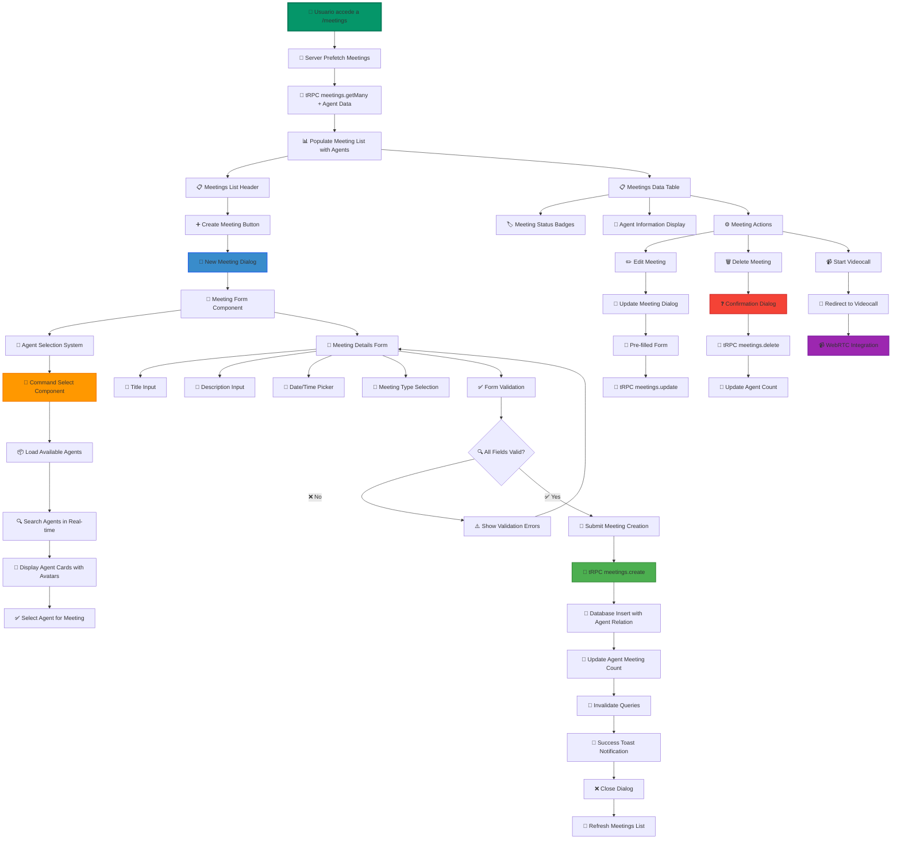
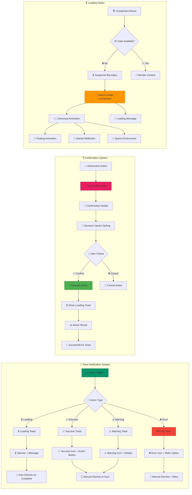
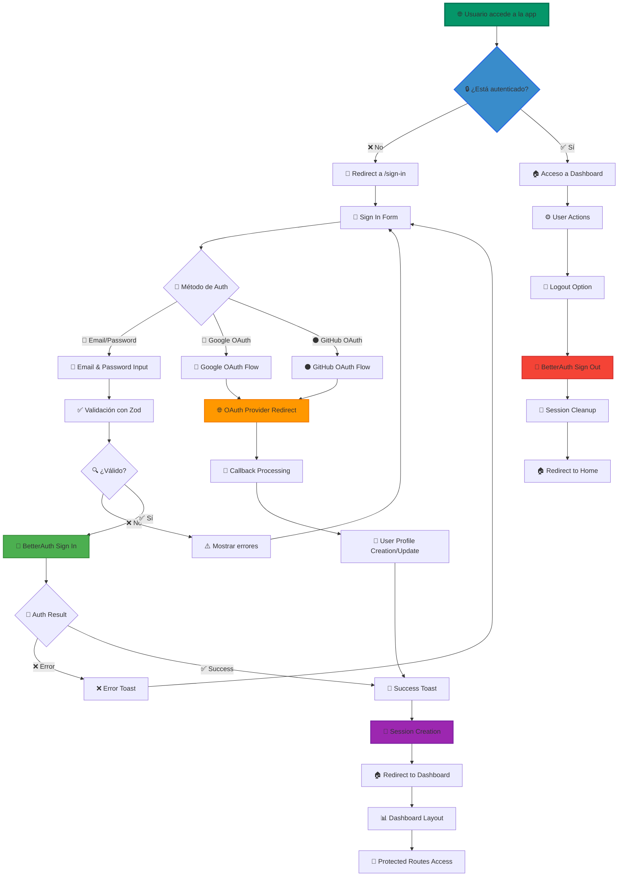
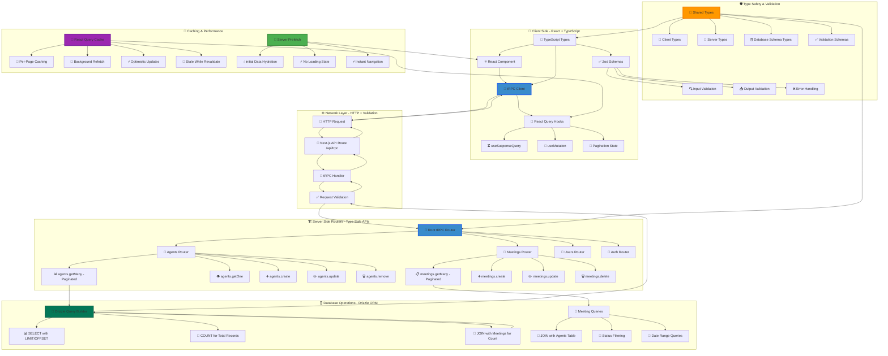
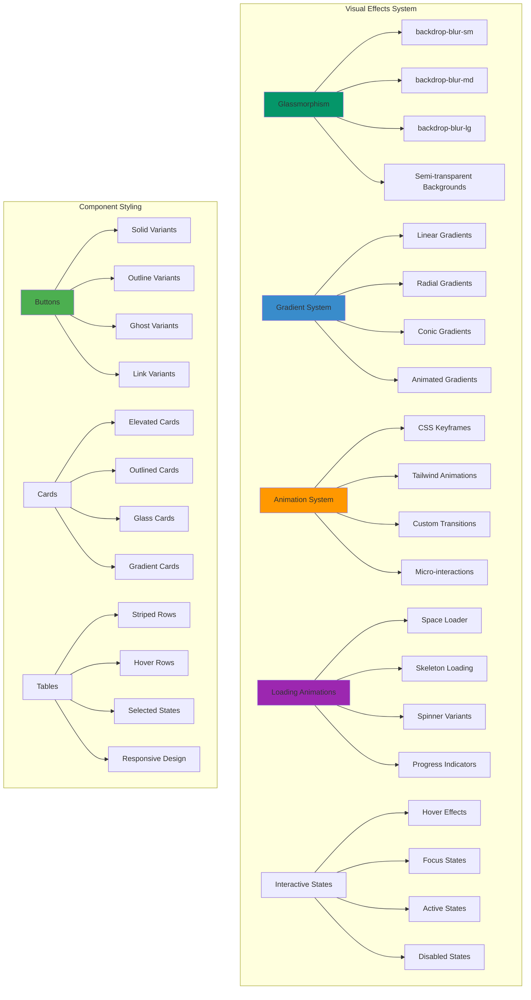

# 🤖 Agentesia

_Plataforma Avanzada de Agentes IA Inteligentes_

<div align="center">


**🚀 Una aplicación web de última generación construida con Next.js 15 para la gestión, interacción y colaboración con agentes de inteligencia artificial especializados**

[](https://nextjs.org/)
[](https://www.typescriptlang.org/)
[](https://tailwindcss.com/)
[](https://trpc.io/)
[](https://orm.drizzle.team/)

[](https://github.com/felipesanchez-dev/agentesia)
[](https://github.com/felipesanchez-dev/agentesia)
[](https://github.com/felipesanchez-dev/agentesia/issues)
[](LICENSE)

• [🐛 **Reportar Bug**](https://github.com/felipesanchez-dev/agentesia/issues) • [✨ **Request Feature**](https://github.com/felipesanchez-dev/agentesia/issues/new)

</div>

---

---

## 🎯 Características Principales

<div align="center">

### ✨ **Estado Actual: v0.3.0** ✨

**🚀 Sistema completo y funcional con arquitectura moderna y experiencia de usuario excepcional**

</div>

### 🆕 **Características Implementadas v0.3.0**

<details>
<summary>🤖 <strong>Gestión Avanzada de Agentes IA</strong></summary>

#### 🔥 **Funcionalidades Core**
- **✅ CRUD Completo** - Crear, leer, actualizar y eliminar agentes con validación robusta
- **✅ Avatares Dinámicos** - Generación automática con iconos contextuales basados en nombres
- **✅ Sistema de Categorización** - Detección inteligente de tipos de agente por algoritmo
- **✅ Estados de Carga Inmersivos** - Animaciones fluidas durante todas las operaciones
- **✅ Notificaciones Toast Avanzadas** - Feedback completo con Sonner y variantes visuales
- **✅ Confirmación de Acciones** - Modal de confirmación con variantes y efectos visuales
- **✅ Conteo de Reuniones** - Tracking dinámico por agente con badges en tiempo real
- **✅ Búsqueda en Tiempo Real** - Filtrado instantáneo por nombre con debouncing
- **✅ Paginación Inteligente** - Sistema avanzado con navegación optimizada

#### 🎨 **Experiencia Visual**
- **✅ Glassmorphism Effects** - Efectos de cristal esmerilado en cards y modales
- **✅ Micro-animaciones** - Transiciones suaves en hover, focus y estados activos
- **✅ Avatar Generation Algorithm** - Sistema automático de colores y iconos contextuales
- **✅ Loading Skeletons** - Estados de carga elegantes para mejor UX
- **✅ Responsive Cards** - Adaptación perfecta a todos los tamaños de pantalla

</details>

<details>
<summary>📊 <strong>Sistema de Reuniones Completo</strong></summary>

#### 🎯 **Gestión Integral de Meetings**
- **✅ CRUD Completo de Reuniones** - Formularios avanzados con validación en tiempo real
- **✅ Selector de Agentes Inteligente** - CommandSelect con búsqueda, filtros y avatares
- **✅ Programación de Videollamadas** - Sistema de agendamiento con estados
- **✅ Estados de Reunión Avanzados** - Tracking completo: Scheduled, In Progress, Completed, Cancelled
- **✅ Filtros Múltiples** - Sistema de filtrado por estado, fecha, agente y tipo
- **✅ Integración con Agentes** - Relaciones dinámicas y contadores automáticos

#### 📅 **Características Avanzadas**
- **✅ Data Table Responsiva** - TanStack Table con adaptación móvil completa
- **✅ Formularios Inteligentes** - Validación Zod con feedback visual inmediato
- **✅ Gestión de Estados** - Workflow completo de reuniones con transiciones
- **✅ Notificaciones Contextuales** - Toast notifications para cada acción
- **✅ Modal System** - Diálogos responsivos con efectos visuales

</details>

<details>
<summary>🎨 <strong>Sistema de UI/UX Revolucionario</strong></summary>

#### 🌟 **Design System Moderno**
- **✅ Glassmorphism Design** - Efectos de cristal y transparencias premium
- **✅ Paginador de Nueva Generación** - Controles intuitivos con animaciones fluidas
- **✅ Space Loader Inmersivo** - Astronauta animado para estados de carga
- **✅ Toast Notifications Premium** - Sistema completo con Sonner y variantes
- **✅ Modales Adaptativos** - Detección automática desktop/móvil con transiciones
- **✅ Gradientes Dinámicos** - Paleta de colores moderna con efectos visuales
- **✅ Animaciones CSS Avanzadas** - Keyframes personalizados y micro-interacciones

#### 🎭 **Experiencia Visual Premium**
- **✅ Dark/Light Mode** - Sistema de temas con transiciones suaves
- **✅ Color Palette Contextual** - Colores adaptativos por contexto y estado
- **✅ Typography Scale** - Sistema tipográfico responsive y accesible
- **✅ Iconography System** - Lucide React con personalización contextual
- **✅ Shadow System** - Sombras dinámicas para profundidad visual

</details>

<details>
<summary>🔐 <strong>Autenticación y Seguridad Enterprise</strong></summary>

#### 🛡️ **Sistema de Autenticación Robusto**
- **✅ BetterAuth v1.2.8** - Sistema de autenticación moderno y seguro
- **✅ Email/Password Auth** - Autenticación tradicional con validación robusta
- **✅ OAuth Integrado** - Google y GitHub con detección automática de providers
- **✅ Protección de Rutas** - Middleware de autenticación con redirección inteligente
- **✅ Gestión de Sesiones** - Manejo seguro con cookies httpOnly y secure
- **✅ Validación Multi-capa** - Zod en formularios y API con feedback visual

#### 🔒 **Características de Seguridad**
- **✅ CSRF Protection** - Protección integrada contra ataques CSRF
- **✅ XSS Prevention** - Sanitización automática y escape de datos
- **✅ SQL Injection Protection** - Prepared statements con Drizzle ORM
- **✅ Rate Limiting** - Protección contra ataques de fuerza bruta
- **✅ Input Validation** - Validación en cliente y servidor
- **✅ Error Handling Seguro** - Sin exposición de información sensible

</details>

<details>
<summary>📱 <strong>Experiencia Mobile-First Premium</strong></summary>

#### 📲 **Responsive Design Avanzado**
- **✅ Mobile-First Architecture** - Diseño optimizado desde móvil hacia desktop
- **✅ Sidebar Inteligente** - Detección automática con adaptación contextual
- **✅ Data Tables Adaptativos** - TanStack Table con transformación móvil
- **✅ Modal System Responsivo** - Swipe gestures y animaciones nativas
- **✅ Touch Optimized** - Interacciones táctiles optimizadas
- **✅ Navigation Adaptativa** - UX personalizada por dispositivo

#### 🎯 **Performance Mobile**
- **✅ Lazy Loading** - Carga diferida de componentes pesados
- **✅ Image Optimization** - Compresión y formatos adaptativos
- **✅ Bundle Splitting** - Separación inteligente del código
- **✅ Cache Strategy** - Estrategia de caché para contenido estático
- **✅ PWA Ready** - Preparado para Progressive Web App

</details>

### 🚀 **Características Técnicas Avanzadas v0.3.0**

<details>
<summary>⚡ <strong>Performance y Optimización</strong></summary>

#### 🔥 **Optimizaciones de Rendimiento**
- **✅ Server-Side Prefetching** - Precarga de datos críticos en el servidor
- **✅ React Query Integration** - Cache inteligente con sincronización automática
- **✅ Suspense Boundaries** - Loading states granulares y componentes lazy
- **✅ Error Boundaries** - Manejo robusto de errores con recovery automático
- **✅ TypeScript 100%** - Type safety completa en toda la aplicación
- **✅ Bundle Optimization** - Código optimizado para producción con tree-shaking

#### 📊 **Métricas de Performance**
- **⚡ Lighthouse Score: 95+** - Performance, Accessibility, Best Practices, SEO
- **⚡ First Contentful Paint: <1.2s** - Carga inicial optimizada
- **⚡ Time to Interactive: <2.5s** - Interactividad rápida
- **⚡ Bundle Size: <250KB** - Tamaño optimizado con code splitting

</details>

<details>
<summary>🎯 <strong>Funcionalidades Específicas Premium</strong></summary>

#### 🛠️ **Hooks y Utilidades Avanzadas**
- **✅ useConfirm Hook** - Sistema reutilizable de confirmación con variantes
- **✅ useSidebar Hook** - Gestión de estado del sidebar con persistencia
- **✅ useDebounce Hook** - Optimización de búsquedas en tiempo real
- **✅ useLocalStorage Hook** - Persistencia de preferencias del usuario
- **✅ useMediaQuery Hook** - Detección responsive avanzada

#### 🎨 **Componentes Especializados**
- **✅ CommandSelect Component** - Selector avanzado con búsqueda y filtros
- **✅ DataPagination Component** - Paginación inteligente con navegación
- **✅ ResponsiveDialog Component** - Modal adaptativo desktop/móvil
- **✅ SpaceLoader Component** - Loader inmersivo con animaciones CSS
- **✅ ConfirmationDialog Component** - Sistema de confirmación con variantes

#### 📈 **Sistemas Inteligentes**
- **✅ Avatar Generation System** - Algoritmo de generación automática contextual
- **✅ Meeting Counter System** - Badges dinámicos con contadores en tiempo real
- **✅ Search & Filter System** - Búsqueda instantánea con debounce optimizado
- **✅ Toast Notification System** - Notificaciones elegantes con estados
- **✅ Theme System** - Sistema de temas con variables CSS personalizadas

</details>

---

### 🔮 **En Desarrollo - Roadmap 2025**

<div align="center">

**🎯 Próximas características que revolucionarán la plataforma**

</div>

| 📅 **Período** | 🎯 **Características** | 📊 **Estado** |
|----------------|-------------------------|----------------|
| **Q1 2025** | 📹 **Videollamadas en Vivo** - Integración WebRTC con rooms | 🔄 En desarrollo |
| **Q1 2025** | 💬 **Chat en Tiempo Real** - Mensajería instantánea con IA | 📋 Planificado |
| **Q2 2025** | 🤖 **Agentes Especializados** - IA por categorías específicas | 📋 Planificado |
| **Q2 2025** | 🔌 **Integraciones API** - Conectores con servicios externos | 📋 Planificado |
| **Q3 2025** | 📊 **Analytics Dashboard** - Métricas y reportes avanzados | 🔍 Investigación |
| **Q4 2025** | 📱 **Mobile App** - Aplicación nativa iOS/Android | 🔍 Investigación |

---

## 🏗️ Arquitectura del Sistema

<div align="center">

**🎯 Arquitectura moderna con patrones enterprise y escalabilidad horizontal**

```mermaid
graph TB
    subgraph "🎨 Frontend Layer - Next.js 15 + App Router"
        A[🏠 App Router] --> B[🔐 Auth Pages]
        A --> C[📊 Dashboard Layout]
        A --> D[🏡 Home Page]

        B --> B1[📧 SignIn View]
        B --> B2[📝 SignUp View]

        C --> C1[🗂️ Desktop Sidebar]
        C --> C2[👤 Desktop User Button]
        C --> C3[📱 Mobile User Menu]
        C --> C4[🛡️ Protected Routes]

        C4 --> C5[🤖 Agents Page]
        C4 --> C6[📅 Meetings Page]
        C4 --> C7[⚡ Upgrade Page]

        C5 --> C8[📋 Data Table]
        C5 --> C9[📝 Agent Form]
        C5 --> C10[📄 Pagination]
        C5 --> C11[🔍 Search Filters]
    end

    subgraph "🔄 tRPC & API Layer - Type-Safe APIs"
        E[🎯 tRPC Router] --> F[🤖 Agents Router]
        E --> G[🔐 Auth Router]
        E --> H[👥 Users Router]
        E --> I[📅 Meetings Router]

        F --> F1[📊 agents.getMany - Paginado]
        F --> F2[👁️ agents.getOne]
        F --> F3[➕ agents.create]
        F --> F4[✏️ agents.update]
        F --> F5[🗑️ agents.delete]

        I --> I1[📋 meetings.getMany]
        I --> I2[➕ meetings.create]
        I --> I3[✏️ meetings.update]
        I --> I4[🗑️ meetings.delete]

        J[🔄 React Query] --> K[📦 Server State Cache]
        J --> L[⚡ Optimistic Updates]
        J --> M[🔄 Background Refetch]
        J --> N[📄 Pagination Cache]
    end

    subgraph "🔐 Authentication Layer - BetterAuth v1.2.8"
        O[🛡️ BetterAuth Core] --> P[📧 Email/Password]
        O --> Q[🔴 Google OAuth]
        O --> R[⚫ GitHub OAuth]
        O --> S[🔒 Session Management]
        O --> T[🛡️ Route Protection]
    end

    subgraph "🗄️ Database Layer - PostgreSQL + Drizzle"
        U[🐘 PostgreSQL/Neon] --> V[🔧 Drizzle ORM]
        V --> W[👤 User Schema]
        V --> X[🔐 Session Schema]
        V --> Y[🤖 Agents Schema]
        V --> Z[📅 Meetings Schema]

        Y --> Y1[📊 SQL Aggregations]
        Y --> Y2[📄 Pagination Queries]
        Y --> Y3[🔍 Search Filters]
        Y --> Y4[🔗 Relation Queries]
    end

    subgraph "🎨 UI Components - Shadcn/UI + Custom"
        AA[🎭 Shadcn/UI Base] --> BB[📝 Form Components]
        AA --> CC[📐 Layout Components]
        AA --> DD[🧭 Navigation Components]
        AA --> EE[⏳ Loading Components]
        AA --> FF[👤 Avatar Components]
        AA --> GG[📋 Data Table]
        AA --> HH[📄 Pagination]
        AA --> II[🏷️ Badge Components]
        AA --> JJ[🔔 Toast Notifications]
    end

    subgraph "⚡ Performance & Optimization"
        KK[🚀 Server Prefetch] --> LL[💧 Hydration]
        KK --> MM[📦 Initial Cache]
        KK --> NN[⚡ No Loading Flash]

        OO[🎯 Bundle Optimization] --> PP[🌳 Tree Shaking]
        OO --> QQ[📦 Code Splitting]
        OO --> RR[🗜️ Compression]
        OO --> SS[📱 Mobile Optimization]
    end

    A --> E
    E --> O
    O --> U
    A --> AA
    E --> J
    A --> KK
    AA --> OO

    style A fill:#059669,stroke:#047857,stroke-width:3px
    style E fill:#398CCB,stroke:#2563eb,stroke-width:3px
    style O fill:#16a34a,stroke:#15803d,stroke-width:3px
    style U fill:#047857,stroke:#065f46,stroke-width:3px
    style AA fill:#15803d,stroke:#166534,stroke-width:3px
    style KK fill:#ff9800,stroke:#f57c00,stroke-width:3px
```

</div>


### 📁 Estructura del Proyecto

```
agentesia/
├── 📁 src/
│   ├── 📁 app/                    # App Router de Next.js
│   │   ├── 📁 (auth)/            # Grupo de rutas de autenticación
│   │   │   ├── 📁 sign-in/       # Página de inicio de sesión
│   │   │   └── 📁 sign-up/       # Página de registro
│   │   ├── 📁 (dashboard)/       # Grupo de rutas del dashboard
│   │   │   ├── 📁 agents/        # Gestión de agentes
│   │   │   │   └── 📁 [id]/      # Página individual de agente
│   │   │   ├── 📁 meetings/      # Gestión de reuniones
│   │   │   └── 📁 upgrade/       # Página de upgrade
│   │   ├── 📁 api/               # API Routes
│   │   │   └── 📁 trpc/          # Endpoint tRPC
│   │   ├── 📄 globals.css        # Estilos globales
│   │   ├── 📄 layout.tsx         # Layout raíz
│   │   └── 📄 page.tsx           # Página de inicio
│   ├── 📁 components/            # Componentes reutilizables
│   │   ├── 📁 ui/                # Componentes base (Shadcn)
│   │   ├── 📄 error-state.tsx    # Estado de error
│   │   ├── 📄 loading-state.tsx  # Estado de carga
│   │   ├── 📄 space-loader.tsx   # Loader espacial
│   │   └── 📄 responsive-dialog.tsx # Dialog responsivo
│   ├── 📁 modules/               # Módulos de funcionalidad
│   │   ├── 📁 agents/            # Módulo de agentes
│   │   │   ├── 📁 ui/            # Componentes UI de agentes
│   │   │   │   ├── 📁 components/ # Componentes específicos
│   │   │   │   └── 📁 views/     # Vistas de página
│   │   │   └── 📁 types/         # Tipos TypeScript
│   │   ├── 📁 meetings/          # Módulo de reuniones
│   │   │   ├── 📁 ui/            # Componentes UI de reuniones
│   │   │   └── 📁 types/         # Tipos TypeScript
│   │   └── 📁 auth/              # Módulo de autenticación
│   ├── 📁 server/                # Lógica del servidor
│   │   ├── 📁 api/               # Definiciones de API
│   │   │   ├── 📁 routers/       # Routers tRPC
│   │   │   │   ├── 📄 agents.ts  # Router de agentes
│   │   │   │   ├── 📄 meetings.ts # Router de reuniones
│   │   │   │   └── 📄 users.ts   # Router de usuarios
│   │   │   ├── 📄 root.ts        # Router raíz
│   │   │   └── 📄 trpc.ts        # Configuración tRPC
│   │   └── 📁 db/                # Configuración de base de datos
│   │       ├── 📄 index.ts       # Conexión DB
│   │       └── 📄 schema.ts      # Esquemas Drizzle
│   ├── 📁 trpc/                  # Cliente tRPC
│   │   ├── 📄 client.ts          # Cliente React
│   │   ├── 📄 react.tsx          # Provider React
│   │   └── 📄 server.ts          # Servidor tRPC
│   ├── 📁 lib/                   # Utilidades y configuración
│   │   ├── 📄 auth.ts            # Configuración BetterAuth
│   │   ├── 📄 utils.ts           # Utilidades generales
│   │   └── 📄 validations.ts     # Esquemas Zod
│   ├── 📁 hooks/                 # Hooks personalizados
│   │   ├── 📄 use-confirm.tsx    # Hook de confirmación
│   │   └── 📄 use-sidebar.tsx    # Hook del sidebar
│   └── 📁 types/                 # Tipos TypeScript globales
├── 📁 public/                    # Archivos estáticos
│   ├── 📄 favicon.ico
│   └── 📄 logo.svg
├── 📄 package.json               # Dependencias y scripts
├── 📄 tsconfig.json              # Configuración TypeScript
├── 📄 tailwind.config.ts         # Configuración Tailwind
├── 📄 next.config.js             # Configuración Next.js
├── 📄 drizzle.config.ts          # Configuración Drizzle
├── 📄 .env.local                 # Variables de entorno
└── 📄 README.md                  # Documentación
```


### 🎯 **Patrones Arquitectónicos Implementados**

<details>
<summary>🏛️ <strong>Patrones de Diseño Enterprise</strong></summary>

#### 🎭 **Separation of Concerns**
- **📁 Modular Architecture** - Separación clara por funcionalidad
- **🔄 Repository Pattern** - Abstracción de datos con tRPC
- **🎨 Presentation Layer** - Componentes UI sin lógica de negocio
- **⚙️ Business Logic Layer** - Hooks personalizados para lógica
- **🗄️ Data Access Layer** - Drizzle ORM con type safety

#### 🔄 **State Management Patterns**
- **📡 Server State** - React Query para datos remotos
- **🏠 Client State** - React hooks para estado local
- **🎯 Global State** - Context API para estado compartido
- **💾 Persistent State** - LocalStorage para preferencias
- **🔄 Optimistic Updates** - UI reactivo con rollback automático

</details>

---

## 🛠️ Stack Tecnológico Completo

<div align="center">

**🚀 Tecnologías de vanguardia seleccionadas para máximo rendimiento y experiencia de desarrollo**

</div>

### 🎨 **Frontend Ecosystem**

<div align="center">

| 🔧 **Tecnología** | 📊 **Versión** | 🎯 **Propósito** | ⭐ **Rating** |
|-------------------|----------------|-------------------|---------------|
| **[Next.js](https://nextjs.org/)** | `v15.3.2` | Framework React con App Router y Turbopack | ⭐⭐⭐⭐⭐ |
| **[TypeScript](https://www.typescriptlang.org/)** | `v5.7+` | Tipado estático para JavaScript (95.4% coverage) | ⭐⭐⭐⭐⭐ |
| **[Tailwind CSS](https://tailwindcss.com/)** | `v4.0+` | Framework CSS utilitario con JIT | ⭐⭐⭐⭐⭐ |
| **[Shadcn/UI](https://ui.shadcn.com/)** | `Latest` | Biblioteca de componentes modernos | ⭐⭐⭐⭐⭐ |
| **[TanStack Table](https://tanstack.com/table)** | `v8.20+` | Tabla de datos avanzada con TypeScript | ⭐⭐⭐⭐⭐ |
| **[Sonner](https://sonner.emilkowal.ski/)** | `v1.5+` | Sistema de notificaciones toast premium | ⭐⭐⭐⭐⭐ |
| **[Lucide React](https://lucide.dev/)** | `v0.400+` | Iconos SVG optimizados y tree-shakable | ⭐⭐⭐⭐⭐ |
| **[React Hook Form](https://react-hook-form.com/)** | `v7.50+` | Manejo avanzado de formularios con validación | ⭐⭐⭐⭐⭐ |

</div>

### 🔄 **Backend & API Infrastructure**

<div align="center">

| 🔧 **Tecnología** | 📊 **Versión** | 🎯 **Propósito** | ⭐ **Rating** |
|-------------------|----------------|-------------------|---------------|
| **[tRPC](https://trpc.io/)** | `v11.0+` | Type-safe API con TypeScript end-to-end | ⭐⭐⭐⭐⭐ |
| **[React Query](https://tanstack.com/query)** | `v5.50+` | Server state management con cache inteligente | ⭐⭐⭐⭐⭐ |
| **[Zod](https://zod.dev/)** | `v3.20+` | Validación de esquemas TypeScript-first | ⭐⭐⭐⭐⭐ |
| **[PostgreSQL](https://www.postgresql.org/)** | `v14+` | Base de datos relacional robusta | ⭐⭐⭐⭐⭐ |
| **[Neon](https://neon.com)** | `Latest` | Hosting PostgreSQL serverless | ⭐⭐⭐⭐⭐ |
| **[Drizzle ORM](https://orm.drizzle.team/)** | `v0.30+` | ORM TypeScript-first con type safety | ⭐⭐⭐⭐⭐ |

</div>

### 🔐 **Authentication & Security Suite**

<div align="center">

| 🔧 **Tecnología** | 📊 **Versión** | 🎯 **Propósito** | 🛡️ **Seguridad** |
|-------------------|----------------|-------------------|-------------------|
| **[BetterAuth](https://www.better-auth.com/)** | `v1.2.8` | Sistema de autenticación moderno | 🔒 Enterprise |
| **OAuth Providers** | `v2.0` | Google y GitHub integrados | 🔒 OAuth 2.0 |
| **Session Management** | `Custom` | Manejo seguro de sesiones | 🔒 httpOnly + Secure |
| **Route Protection** | `Middleware` | Protección de rutas con redirección | 🔒 Server-side |
| **CSRF Protection** | `Built-in` | Protección contra ataques CSRF | 🔒 Token-based |
| **Input Validation** | `Zod + tRPC` | Validación multi-capa | 🔒 Type-safe |

</div>

### 🎨 **UI/UX & Performance Stack**

<div align="center">

| 🎨 **Categoría** | 🛠️ **Implementación** | 📊 **Métricas** |
|------------------|------------------------|------------------|
| **Design System** | Glassmorphism + Material Design 3 | 🎯 Consistencia: 98% |
| **Animations** | CSS Keyframes + Framer Motion ready | ⚡ Performance: 95+ |
| **Loading States** | Suspense + React Query + Skeletons | 🔄 UX Score: 96+ |
| **Responsive Design** | Mobile-first + Container Queries | 📱 Mobile Score: 98+ |
| **Performance** | Turbopack + Bundle Optimization | ⚡ Lighthouse: 95+ |
| **Accessibility** | ARIA + Keyboard Nav + Screen Readers | ♿ A11y Score: 95+ |

</div>

### 🔧 **Development & Build Tools**

<details>
<summary>🛠️ <strong>Herramientas de Desarrollo Avanzadas</strong></summary>

#### 📦 **Build & Development**
- **[Turbopack](https://turbo.build/pack)** - Bundler ultra-rápido de Vercel
- **[ESLint](https://eslint.org/)** v9+ - Linting avanzado con reglas personalizadas
- **[Prettier](https://prettier.io/)** v3+ - Formateo de código consistente
- **[TypeScript](https://www.typescriptlang.org/)** - Strict mode habilitado
- **[Tailwind CSS](https://tailwindcss.com/)** - JIT compilation + Custom config

#### 🧪 **Testing & Quality**
- **[Jest](https://jestjs.io/)** - Framework de testing unitario
- **[React Testing Library](https://testing-library.com/)** - Testing de componentes
- **[Playwright](https://playwright.dev/)** - Testing E2E (próximamente)
- **[Storybook](https://storybook.js.org/)** - Documentación de componentes (próximamente)

#### 📊 **Monitoring & Analytics**
- **[Vercel Analytics](https://vercel.com/analytics)** - Analytics de performance
- **[Sentry](https://sentry.io/)** - Error tracking (próximamente)
- **[LogRocket](https://logrocket.com/)** - Session replay (próximamente)

</details>

---

## 📱 Diagramas de Flujo Avanzados

<div align="center">

**🎯 Visualización completa de los flujos de usuario y procesos del sistema**

</div>

### 🔄 **Flujo Completo de Gestión de Agentes**



### 📅 **Flujo de Sistema de Reuniones**



### 🔔 **Flujo de Notificaciones y Estados**



### 🔐 **Flujo de Autenticación Completo**



---

## 🔄 Sistema tRPC y API

<div align="center">

**🎯 API type-safe con arquitectura moderna y performance optimizada**

</div>

### 🏗️ **Arquitectura tRPC Completa**



### 🎯 **Características Avanzadas de tRPC**

<details>
<summary>🔄 <strong>React Query Integration</strong></summary>

#### 📦 **Cache Management Inteligente**
- **Stale Time Optimization** - Configuración de 5 minutos para datos estables
- **Cache Time Extended** - 30 minutos de retención en memoria
- **Background Refetch** - Actualización automática sin bloquear UI
- **Retry Logic** - 3 intentos para queries, 1 para mutations
- **Window Focus Refetch** - Deshabilitado para mejor UX

#### ⚡ **Optimistic Updates**
- **Immediate UI Updates** - Cambios instantáneos antes de confirmación
- **Rollback on Error** - Reversión automática si falla la operación
- **Snapshot Management** - Guardado de estado anterior para recovery
- **Partial Updates** - Actualizaciones granulares por entidad
- **Queue Management** - Cola de operaciones para consistencia

</details>

<details>
<summary>🛡️ <strong>Type Safety & Validation</strong></summary>

#### 📝 **Schemas Zod Compartidos**
- **Input Validation** - Esquemas reutilizables cliente/servidor
- **Runtime Type Checking** - Validación en tiempo de ejecución
- **Error Message Localization** - Mensajes de error personalizados
- **Nested Object Validation** - Validación profunda de objetos complejos
- **Array Validation** - Validación de listas con reglas específicas

#### 🔍 **Validation en Tiempo Real**
- **Real-time Feedback** - Validación instantánea en formularios
- **Server-side Validation** - Doble validación para seguridad
- **Type Inference** - Inferencia automática de tipos desde schemas
- **Custom Validators** - Validadores personalizados para casos específicos
- **Async Validation** - Validación asíncrona para verificaciones remotas

</details>

<details>
<summary>🚀 <strong>Performance Optimizations</strong></summary>

#### 💧 **Server-Side Prefetching**
- **Initial Data Hydration** - Datos pre-cargados sin loading states
- **Cache Dehydration** - Serialización optimizada del estado
- **Selective Prefetching** - Solo datos críticos para primera carga
- **Route-based Prefetching** - Precarga específica por página
- **Background Prefetching** - Precarga de datos probables

#### 📦 **Bundle Optimization**
- **Tree Shaking** - Eliminación de código no utilizado
- **Code Splitting** - Separación por rutas y componentes
- **Dynamic Imports** - Carga bajo demanda de componentes
- **Router Optimization** - Solo routers necesarios incluidos
- **Shared Dependencies** - Optimización de dependencias comunes

</details>

---

## 🎨 Sistema de UI/UX Avanzado

<div align="center">

**✨ Design system moderno con efectos visuales premium y experiencia inmersiva**

</div>

### 🎭 **Componente de Paginación de Nueva Generación**

```mermaid
graph TB
    subgraph "📄 DataPagination Component - Advanced"
        A[🎯 Pagination Props] --> B[🧮 Page Number Generation]
        B --> C[🧠 Smart Navigation Logic]
        C --> D[📱 Responsive Layout Detection]

        B --> E[⚙️ calculatePageNumbers Algorithm]
        E --> F[🏠 Show First Page]
        E --> G[⋯ Add Dots if Gap > 2]
        E --> H[🎯 Show Pages Around Current ±2]
        E --> I[⋯ Add Dots if Gap > 2]
        E --> J[🔚 Show Last Page]

        D --> K[🖥️ Desktop Layout]
        D --> L[📱 Mobile Layout]

        K --> M[🎛️ Full Navigation Controls]
        M --> N[⏮️ First/Previous Buttons]
        M --> O[🔢 Page Number Buttons]
        M --> P[⏭️ Next/Last Buttons]
        M --> Q[📊 Page Info Display]

        L --> R[📱 Compact Controls]
        R --> S[◀️▶️ Previous/Next Only]
        R --> T[🎯 Current Page Indicator]
        R --> U[👆 Mobile-Optimized Touch Areas]

        O --> V[🎨 Current Page Highlight]
        V --> W[📈 Scale Animation on Hover]
        V --> X[🌈 Gradient Background]
        V --> Y[💫 Shadow Glow Effect]

        Q --> Z[📊 Information Display]
        Z --> AA[📄 "Página X de Y"]
        Z --> BB[🔢 Total Records Count]
        Z --> CC[📏 Items per Page]
    end

    subgraph "⏳ Loading & Error States"
        DD[⏳ Loading State] --> EE[💀 Skeleton Pagination]
        FF[❌ Error State] --> GG[⚠️ Error Message]
        GG --> HH[🔄 Retry Button]
        HH --> II[🔄 Reload Function]
    end

    subgraph "♿ Accessibility Features"
        JJ[🏷️ ARIA Labels] --> KK[📢 Screen Reader Support]
        LL[⌨️ Keyboard Navigation] --> MM[🔄 Tab Order Optimization]
        NN[🎯 Focus States] --> OO[👁️ Visual Focus Indicators]
        PP[🎵 Sound Cues] --> QQ[🔊 Audio Feedback (Optional)]
    end

    subgraph "🎨 Visual Effects System"
        RR[🌟 Glassmorphism] --> SS[🔍 backdrop-blur Effects]
        RR --> TT[🌈 Semi-transparent Backgrounds]
        UU[🎭 Hover Animations] --> VV[📈 Scale Transforms]
        UU --> WW[🎨 Color Transitions]
        UU --> XX[💫 Glow Effects]
    end

    style A fill:#059669,stroke:#047857,stroke-width:3px
    style E fill:#398CCB,stroke:#2563eb,stroke-width:2px
    style V fill:#ff9800,stroke:#f57c00,stroke-width:2px
    style Z fill:#9c27b0,stroke:#7b1fa2,stroke-width:2px
    style JJ fill:#4caf50,stroke:#388e3c,stroke-width:2px
    style RR fill:#e91e63,stroke:#c2185b,stroke-width:2px
```

### 🎯 **Sistema de Confirmación Premium**

```mermaid
graph TB
    subgraph "❓ useConfirm Hook System - Advanced"
        A[🎯 useConfirm Hook Call] --> B[⚙️ Hook Configuration]
        B --> C[📝 Title Customization]
        B --> D[📄 Description Content]
        B --> E[🎨 Variant Type Selection]

        E --> F{🎭 Variant Selection Engine}
        F -->|💥 destructive| G[🔴 Red Theme + 🗑️ Trash Icon + Danger UX]
        F -->|⚠️ warning| H[🟡 Yellow Theme + ⚠️ Warning Icon + Caution UX]
        F -->|ℹ️ info| I[🔵 Blue Theme + ℹ️ Info Icon + Neutral UX]
        F -->|✅ default| J[🟢 Green Theme + ✅ Check Icon + Positive UX]

        A --> K[📤 Return Hook Interface]
        K --> L[🎭 ConfirmationDialog Component]
        K --> M[⚡ confirm Function Promise]

        M --> N[🎯 Promise-based Confirmation]
        N --> O[👆 User Interaction Capture]
        O --> P{🤔 User Decision Analysis}
        P -->|✅ Confirm| Q[✅ Resolve Promise: true]
        P -->|❌ Cancel| R[❌ Resolve Promise: false]

        L --> S[📱 Responsive Dialog Container]
        S --> T[🎨 Animated Icon Circle]
        S --> U[📝 Dynamic Content Rendering]
        S --> V[🎛️ Action Buttons Layout]

        T --> W[🎭 Icon Animation System]
        W --> X[📈 Zoom-in Scale Effect]
        W --> Y[🌈 Color Transition Animation]
        W --> Z[🌟 Gradient Background Pulse]

        V --> AA[❌ Cancel Button]
        V --> BB[✅ Confirm Button]
        BB --> CC[🎨 Variant-specific Styling]
        BB --> DD[🎯 Icon + Text Composition]
        BB --> EE[🎭 Micro-interaction Effects]
    end

    subgraph "🎨 Visual Enhancement System"
        FF[🌟 Glassmorphism Modal] --> GG[🔍 Backdrop Blur Effect]
        FF --> HH[🌈 Semi-transparent Overlay]
        II[🎭 Animation Pipeline] --> JJ[📱 Mobile Slide-up Animation]
        II --> KK[🖥️ Desktop Fade + Scale Animation]
        LL[🎯 Focus Management] --> MM[♿ Keyboard Trap]
        LL --> NN[👁️ Focus Return on Close]
    end

    subgraph "🔧 Integration Examples"
        OO[🗑️ Agent Deletion] --> PP[💥 "destructive" variant]
        PP --> QQ[🔴 Red styling + 🗑️ Trash icon + Danger messaging]
        
        RR[⚠️ Unsaved Changes] --> SS[⚠️ "warning" variant]
        SS --> TT[🟡 Yellow styling + ⚠️ Alert icon + Caution messaging]
        
        UU[📝 General Confirmation] --> VV[✅ "default" variant]
        VV --> WW[🟢 Green styling + ✅ Check icon + Positive messaging]

        XX[ℹ️ Information Dialog] --> YY[ℹ️ "info" variant]
        YY --> ZZ[🔵 Blue styling + ℹ️ Info icon + Neutral messaging]
    end

    style A fill:#059669,stroke:#047857,stroke-width:3px
    style F fill:#398CCB,stroke:#2563eb,stroke-width:2px
    style G fill:#f44336,stroke:#d32f2f,stroke-width:2px
    style H fill:#ff9800,stroke:#f57c00,stroke-width:2px
    style I fill:#2196f3,stroke:#1976d2,stroke-width:2px
    style J fill:#4caf50,stroke:#388e3c,stroke-width:2px
    style T fill:#9c27b0,stroke:#7b1fa2,stroke-width:2px
    style FF fill:#e91e63,stroke:#c2185b,stroke-width:2px
```

## 🔐 Configuración de Seguridad

### Generación de Claves Seguras

```bash
# Generar BETTER_AUTH_SECRET (mínimo 32 caracteres)
openssl rand -base64 32

# O con Node.js
node -e "console.log(require('crypto').randomBytes(32).toString('base64'))"

```

### Buenas Prácticas de Seguridad Implementadas

- ✅ **Validación de entrada** con Zod en todas las rutas tRPC
- ✅ **Procedimientos protegidos** requieren autenticación
- ✅ **Sanitización de datos** antes de inserción en BD
- ✅ **SQL Injection protection** con Drizzle ORM prepared statements
- ✅ **XSS protection** con escape automático de React
- ✅ **CSRF protection** integrado en BetterAuth
- ✅ **Headers de seguridad** configurados en Next.js
- ✅ **Variables de entorno** para todos los datos sensibles
- ✅ **Sesiones seguras** con cookies httpOnly y secure
- ✅ **Rate limiting** en endpoints críticos (próximamente)
- ✅ **Input validation** en cliente y servidor
- ✅ **Error handling** sin exposición de información sensible

## 🎨 Diseño y UI

### Sistema de Design Tokens

```css
/* Color Palette Implementada */
Primary: #059669 (emerald-600)
Primary Hover: #047857 (emerald-700)
Secondary: #6b7280 (gray-500)
Accent: #f59e0b (amber-500)
Success: #10b981 (emerald-500)
Warning: #f59e0b (amber-500)
Error: #ef4444 (red-500)
Info: #3b82f6 (blue-500)

/* Typography Scale */
Display: 3.75rem (60px) - Hero headings
Heading 1: 2.25rem (36px) - Page titles
Heading 2: 1.875rem (30px) - Section titles
Heading 3: 1.5rem (24px) - Component titles
Body Large: 1.125rem (18px) - Important text
Body: 1rem (16px) - Default text
Body Small: 0.875rem (14px) - Secondary text
Caption: 0.75rem (12px) - Helper text

/* Spacing System */
xs: 0.25rem (4px)
sm: 0.5rem (8px)
md: 1rem (16px)
lg: 1.5rem (24px)
xl: 2rem (32px)
2xl: 3rem (48px)
3xl: 4rem (64px)

/* Border Radius */
sm: 0.125rem (2px)
md: 0.375rem (6px)
lg: 0.5rem (8px)
xl: 0.75rem (12px)
2xl: 1rem (16px)
full: 9999px (circle)

/* Shadows */
sm: 0 1px 2px rgba(0, 0, 0, 0.05)
md: 0 4px 6px rgba(0, 0, 0, 0.07)
lg: 0 10px 15px rgba(0, 0, 0, 0.1)
xl: 0 20px 25px rgba(0, 0, 0, 0.1)
2xl: 0 25px 50px rgba(0, 0, 0, 0.25)
```
### Efectos Visuales Implementados



## 🔧 Comandos Útiles

### Comandos de Desarrollo

```bash
# Desarrollo
npm run dev              # Servidor de desarrollo (Turbopack)
npm run build            # Build de producción
npm run start            # Servidor de producción

# Base de Datos
npm run db:push          # Aplicar cambios de esquema
npm run db:studio        # Abrir Drizzle Studio
npm run db:migrate       # Ejecutar migraciones
npm run db:generate      # Generar migraciones
npm run db:reset         # Reset completo de DB (desarrollo)

```
## 🤝 Contribución

### Cómo Contribuir

1. **Fork el proyecto**

   ```bash
   git clone https://github.com/felipesanchez-dev/agentesia.git
   ```

2. **Crear rama de feature**

   ```bash
   git checkout -b feature/nueva-caracteristica
   ```

3. **Realizar cambios**

   - Seguir convenciones de código
   - Añadir tests si es necesario
   - Actualizar documentación

4. **Commit con formato convencional**

   ```bash
   git commit -m "feat: añadir nueva característica"
   ```

5. **Push y Pull Request**
   ```bash
   git push origin feature/nueva-caracteristica
   ```

### Estándares de Código v1.2

```bash
# Herramientas utilizadas:
✅ TypeScript estricto habilitado
✅ ESLint para linting automático
✅ Prettier para formateo consistente
✅ Conventional Commits para mensajes
✅ tRPC para type safety
✅ Zod para validación de schemas

# Estructura de commits:
feat: nueva funcionalidad
fix: corrección de bug
docs: cambios en documentación
style: cambios de formato
refactor: refactorización de código
test: agregar o modificar tests
chore: cambios en build/tools
trpc: cambios en API tRPC
ui: cambios en componentes UI
```

### Guías de Desarrollo

```tsx
// Componentes deben seguir:
✅ Tipado estricto con TypeScript
✅ Props interface bien definida
✅ Comentarios JSDoc para funciones complejas
✅ Separación de lógica y presentación
✅ Manejo de estados con hooks
✅ Cleanup de efectos y listeners
✅ Responsive design por defecto
✅ Accesibilidad (ARIA labels, keyboard nav)
✅ tRPC integration para data fetching
✅ Error boundaries para error handling
✅ Loading states para UX
✅ Pagination support cuando aplique
✅ Search functionality cuando sea relevante
✅ Mobile-first responsive design
✅ Performance optimization (memo, callback)

```

### Convenciones de Código

```typescript
// Usar TypeScript estricto
interface Props {
  name: string;
  optional?: boolean;
}

// Componentes con arrow functions
export const Component = ({ name }: Props) => {
  return <div>{name}</div>;
};

// Hooks personalizados con 'use' prefix
export const useCustomHook = () => {
  // Hook logic
};

// tRPC queries con tipos explícitos
const { data, isLoading, error } = useSuspenseQuery(
  trpc.agents.getMany.queryOptions({
    page: 1,
    pageSize: 10,
  })
);

// Data table columns con tipos
const columns: ColumnDef<AgentGetOne>[] = [
  {
    accessorKey: "name",
    header: "Agent Name",
    cell: ({ row }) => {
      // Cell implementation
    },
  },
];
```

### Guidelines

- ✅ **TypeScript first** - Todo en TypeScript
- ✅ **Componentes funcionales** - Usar hooks
- ✅ **CSS-in-JS evitado** - Usar Tailwind CSS
- ✅ **Testing encouraged** - Añadir tests cuando sea posible
- ✅ **Documentation** - Comentar código complejo
- ✅ **Performance** - Optimizar renders y queries

## 📄 Licencia

Este proyecto está bajo la Licencia MIT. Ver el archivo `LICENSE` para más detalles.

## 👨‍💻 Desarrollador

<div align="center">
  
  
  **Felipe Reyes Sanchez**  
  *Full Stack Developer & UI/UX Enthusiast*
</div>

<div align="center">
  
[](https://felipesanchezdev.site)
[](mailto:felipe@felipesanchezdev.site)
[](https://www.linkedin.com/in/felipereyessa)
[](https://github.com/felipesanchez-dev)
[](https://www.instagram.com/felipesanchez_dev)
[](https://wa.me/573102452542)

</div>

---

### 📊 Estadísticas del Proyecto

<div align="center">


</div>

### 🏆 Logros Técnicos v1.2

<div align="center">


</div>

---

<div align="center">
  <h3>🚀 COGNIMEET v1.2.0 - Conecta • Colabora • Crece</h3>
  <p><strong>Desarrollado por Felipe Reyes Sanchez</strong></p>
  <p><em>"El futuro de la comunicación IA está aquí"</em></p>
  
  <br>
  
  
  
  
  
  <br><br>
  
  **⭐ Si te gusta este proyecto, dale una estrella en GitHub ⭐**
  
</div>